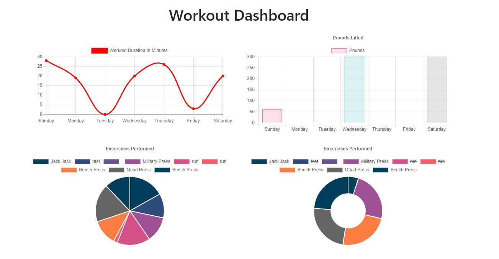
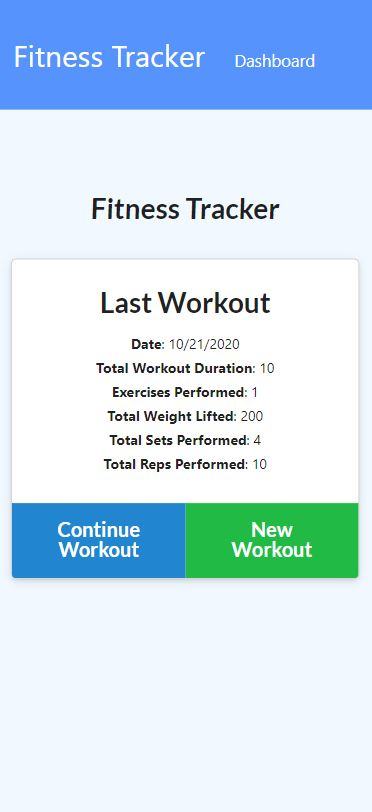

# Fitness Tracker 
  [](https://github.com/wilsoncollin7?tab=followers) [](https://opensource.org/licenses/MIT)

  This application helps the user track their fitness by uploading their workouts onto the app. The app keeps track of all the workouts and displays them in graphs so the user can better understand their fitness history!

  Here is the deployed application on Heroku: [Fitness Tracker](https://fitness-tracker-wilsoncollin7.herokuapp.com/?id=5f9074f7657ae30017bd0fa4)

  
  <p align="center">
    
  </p>

  ## Table of Contents

  - [Installation](#installation)
  - [Usage](#usage)
  - [License](#license)
  - [Contributing](#contributing)
  - [Tests](#tests)
  - [Questions](#questions)

  ## Installation

  You can clone the repo and launch the app on your own localhost, and set up your own heroku so the app is always available. You will need to initialize Mongolab for heroku to work.

  ```
  $ heroku addons:create mongolab -a {YOUR APP NAME}
  ```

  ## Usage

  This project uses a Node.js Express server and a Mongoose database.

  ## License

  This application is made with the [MIT License](https://opensource.org/licenses/MIT)

  ## Contributing

  To contribute please contact me!

  ## Tests

  If you find any bugs or issues please contact me!

  ## Questions

  For any questions you might have, you can email me at wilsoncollin7@gmail.com. You can also check out my [GitHub Profile](https://github.com/wilsoncollin7).

